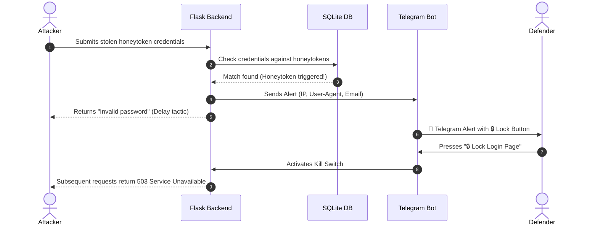

# Database Honeytoken Sentinel |     

> An educational, defensive web honeypot that plants synthetic decoy credentials in SQLite, presents a corporate-style login page, and can alert defenders via Telegram when a decoy is used. A Telegram button can activate the login-page kill switch.

<table>
  <tr>
    <td></td>
    <td></td>
    <td></td>
  </tr>
</table>

---

## Why It Matters

### 🛡️ Defense-in-Depth

What happens if your WAF, IDS, or SIEM fails to catch an advanced SQL injection or a stealthy database exfiltration?

By planting monitored decoy credentials (honeytokens) in a dedicated test database, defenders can receive an alert when one is used. Alerts only indicate interaction with a seeded decoy; they do not guarantee detection of every attack or replace a WAF, IDS, or SIEM.

### 🚨 Instant Disaster Containment (Kill Switch)

Speed is everything during a breach. With direct **Telegram Bot integration**, you don't need a 24/7 SOC team or complex incident response playbooks:
- Get **real-time forensics** (Attacker IP, User-Agent, and targeted email).
- **One-Click Action**: Hit the lock button directly inside your Telegram chat to instantly shut down the authentication gateway and neutralize the threat before damage spreads.

### 🧠 Attacker Psychology & The Trap Design

Most security traps fail because they look fake. This project leverages authentic adversary workflow behaviors:

- **Deliberately Weak Hashing**: Seeded decoy passwords are generated per installation and stored as MD5 hashes to model a legacy database dump. MD5 is insecure for password storage and must never be used for real accounts.
- **Least-Privilege Realism**: Decoy accounts are structured with historical timestamps (6+ months old) and specific roles (Support, Backup, Admin) to pass automated reconnaissance checks and look 100% legitimate inside an exfiltrated SQL dump.

Most basic honeytokens fail because they look obviously fake, like `admin@test.com`. This system is engineered with **psychological realism** to trick attackers:
- Uses synthetic addresses at the reserved `example.com` domain, such as `mohamed_support@example.com` and `omar.khalil@example.com`; these are not real employee identities.
- Each decoy is mapped to **precise, believable roles**—like support, administrator, or backup operator—rather than giving away blanket super-admin powers that immediately look suspicious.
- **Pre-seeded with realistic timelines**—such as account creation dates from six months ago and historical login audit logs—tricking the attacker into believing these are active, vital operational accounts.

---

## Architecture & Attack Flow



---

## Tech Stack

| Layer | Technology |
|---|---|
| **Backend** | Python 3.11, Flask |
| **Database** | SQLite |
| **Frontend** | HTML5, Tailwind CSS (CDN), Vanilla JavaScript |
| **Alerting** | Telegram Bot API |
| **Deployment** | Docker, Docker Compose |

---

## Quick Start & Installation

### Prerequisites
- Python 3.9+ **or** Docker Desktop with Docker Compose
- Telegram Bot Token and Chat ID (optional; required only for Telegram alerts and the remote kill switch)

### Option 1: Docker (Recommended) 🐳

On Windows, start Docker Desktop and wait until its engine is running before using Compose. You can check that Compose is available with `docker compose version`.

```bash
git clone https://github.com/secmaro/database_web_honeypot.git
cd database_web_honeypot
docker compose up --build
```

The app is available at **http://localhost:5000**. Compose works without a `.env` file; Telegram features remain disabled until credentials are configured. To enable them, copy `.env.example` to `.env` and fill in your own bot token, chat ID, and a randomly generated Flask secret key, then restart Compose. Do not commit `.env`.

If Compose reports that it cannot connect to `dockerDesktopLinuxEngine` or the Docker API, start or restart Docker Desktop, wait for the engine to finish starting, then rerun `docker compose up --build` from the `database_web_honeypot` folder.

### Option 2: Local Installation

```bash
git clone https://github.com/secmaro/database_web_honeypot.git
cd database_web_honeypot
python -m venv venv
source venv/bin/activate  # On Windows: venv\Scripts\activate
pip install -r requirements.txt
cp .env.example .env
# Edit .env with your Telegram credentials (optional)
python seed_db.py
python app.py
```

> Open **http://localhost:5000** in your browser.

### Getting Your Telegram Credentials

1. Open Telegram and search for `@BotFather`.
2. Send `/newbot`, follow the prompts, and copy your **Bot Token**.
3. Search for `@userinfobot`, send `/start`, and copy your **Chat ID**.
4. Paste both values into your local `.env` file. Never paste real tokens into source files, issues, screenshots, or commits.

The seeded email identities use the reserved `example.com` domain, and each installation generates new random decoy passwords. Submitted login passwords are **not stored**; only the email, source IP, user agent, timestamp, and honeytoken-match result are recorded. Use synthetic test data only and restrict access to the collected telemetry.

---

## Project Structure

```text
database_web_honeypot/
├── app.py                # Main Flask application (routes, login logic, kill switch)
├── config.py             # Configuration loader (reads .env)
├── seed_db.py            # Database seeder (decoy accounts + fake audit trail)
├── telegram_bot.py       # Telegram alerting + kill-switch long-polling
├── requirements.txt      # Python dependencies
├── .env.example          # Template for secrets (safe to commit)
├── .gitignore            # Git ignore rules
├── Dockerfile            # Container image definition
├── docker-compose.yml    # One-command deployment
└── templates/
    ├── login.html        # Corporate login page (the honeypot trap)
    └── locked.html       # 503 maintenance page (post-kill-switch)
```

---

## How It Works

1. **🌱 Deploy the Trap** — The database is seeded with realistic-looking user accounts, roles, permissions, and historical audit logs spanning 6 months.

2. **💀 Exfiltration** — An attacker breaches the system and steals the database or SQL dump. They find what looks like legitimate employee credentials.

3. **🎣 Trigger** — Confident in their find, the attacker cracks the MD5 hashes and attempts to log in to the portal using the stolen honeytoken credentials.

4. **🚨 Alert** — The Flask backend detects the honeytoken usage and immediately fires a Telegram alert containing the attacker's **IP address**, **User-Agent**, **targeted email**, and **timestamp**.

5. **🔒 Containment** — The defender receives the alert and clicks the inline **"🔒 Lock Login Page"** button in Telegram to instantly activate the kill switch, shutting down the authentication gateway and returning 503 errors to all subsequent requests.

---

## Disclaimer

> [!WARNING]
> **Legal & Ethical Disclaimer**
>
> This tool is developed for educational, defensive, and security testing purposes only. The author is not responsible for any misuse or illegal activities conducted with this software. Deploy it only in environments you own or are explicitly authorized to test. It is a demonstration, not a production authentication service.

---

## License

This project is licensed under the **MIT License** — see the [LICENSE](LICENSE) file for details.
